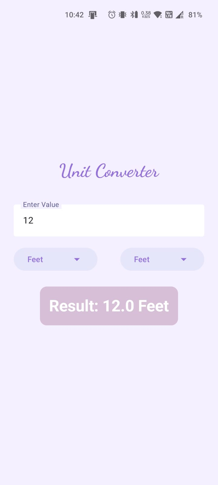

# 📏 Unit Converter App

A simple and clean Android Unit Converter app that converts values between **Feet**, **Centimeters**, **Meters**, and **Millimeters**. This is my very first Android project as I begin learning Android development!

---

## 🚀 Features

- Convert values between:
    - Feet
    - Centimeters (cm)
    - Meters (m)
    - Millimeters (mm)
- Clean and minimal UI
- Instant result display after conversion

---

## 📸 Screenshot



---

## 🛠 Tech Stack

- **Language:** Kotlin 
- **Platform:** Android
- **IDE:** Android Studio

---

## 📦 How to Use

1. Clone the repository:
   ```bash
   git clone https://github.com/your-username/unit-converter-app.git
2. Open the project in Android Studio.

3. Run the app on an emulator or physical device.

4. Enter a value, select the units to convert from and to, and see the result!

📚 Learning Journey
This project is part of my Android development learning journey. I'm just getting started and looking forward to building more apps!

🙌 Feedback
I'm always open to suggestions and improvements. Feel free to open issues or pull requests!